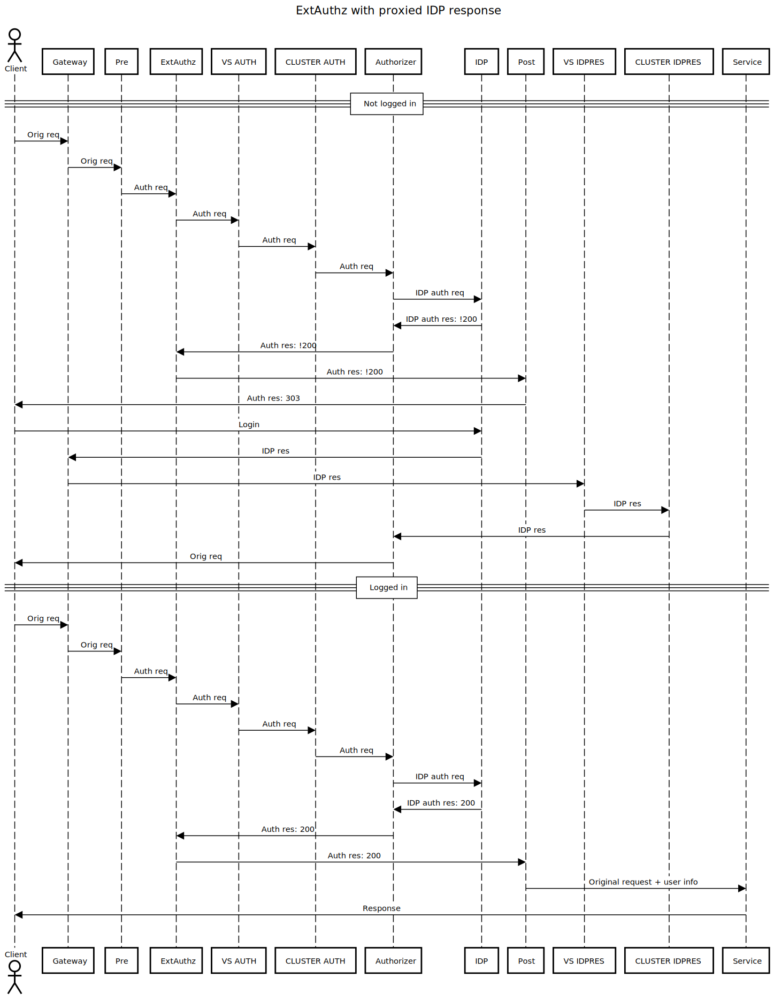

# About
Implementation of ExtAuthz
[Conf](https://www.envoyproxy.io/docs/envoy/latest/configuration/http/http_filters/ext_authz_filter) 
[API](https://www.envoyproxy.io/docs/envoy/latest/api-v3/extensions/filters/http/ext_authz/v3/ext_authz.proto#extensions-filters-http-ext-authz-v3-extauthz)  
  
<details>
  <summary>ExtAuthz Sequence diagram</summary>
  <a href="docs/sequence-diagram.pdf"></a>
</details>


## Config
### Variables
In this case the external authorizer functions like an OIDC Relying Party and accepts trusted issuers with their credentials.  
  
OIDC_ISSUERS is a comma separated list of these issuers.  
  
The Gateway and the service may be in different k8s namespaces. The filter for the APP/service needs to be applied to each namespace that needs to have protected apps.  
  
APP_NAME is just a prefix for all of the filter components.  
  
EXT_AUTH_HOST specifes the hostname of the external authorizer.  
  
REDIRECT_URI is the idpresponse redirect uri that IDP is configured to trust. Usually a k8s gateway with a path to /oidc/idpresponse or /oauth2/idpresponse.  
  
```yaml
APP_NS: default
GW_NS: default
GW_NAME: default-gateway

APP_NAME: ext-auth
EXT_AUTH_HOST: authorizer.myorg.com
REDIRECT_URI: https://gateway.myorg.com/oidc/idpresponse

OIDC_ISSUERS: https://myorg.okta.com/oauth2/default?client_id=...&client_secret=...&scope=openid email profile address phone offline_access,https://myorg.okta.com?client_id=...&client_secret=...&scope=openid email profile address phone offline_access,https://cognito-idp.us-east-1.amazonaws.com/us-east-1_...?client_id=...&https://cognito-idp.us-west-2.amazonaws.com/us-west-2_...?client_id=...
```

### Render
Components of the filter are templatized, and need to be rendered with config from config.yaml:
```bash
./render.sh components/*.yaml > rendered.yaml
```

### Install
```bash
kubectl apply -f rendered.yaml 
```

### Gateway
Add label ${config.APP_NAME}-role to the Gateway you want to support ExtAuthz:
```
ext-auth-role: gateway
```

### Deployment
Add label ${config.APP_NAME}-role to the Deployment you want to be protected by ExtAuthz:
```
ext-auth-role: client
```

Exclude health path, if needed, from auth:
> AUTH_PATH is a comma separated list of single path regexes, with a leading exclamation mark (!) indicating negation.
> OIDC_ISSUERS is a secret:
```
kubectl -n default create secret generic ext-auth \
  --from-literal=OIDC_ISSUERS='https://...' \
  --dry-run=client -o yaml | kubectl apply -f -
```

```
        proxy.istio.io/config: |
          holdApplicationUntilProxyStarts: true
          proxyMetadata:
            AUTH_PATH: "!^/health%-1,!^/health%-2"
        sidecar.istio.io/userVolume: |
          [{"name":"ext-auth","secret":{"secretName":"ext-auth"}}]
        sidecar.istio.io/userVolumeMount: |
          [{"name":"ext-auth","mountPath":"/etc/ext-auth/OIDC_ISSUERS","subPath":"OIDC_ISSUERS","readOnly":true}]
```

